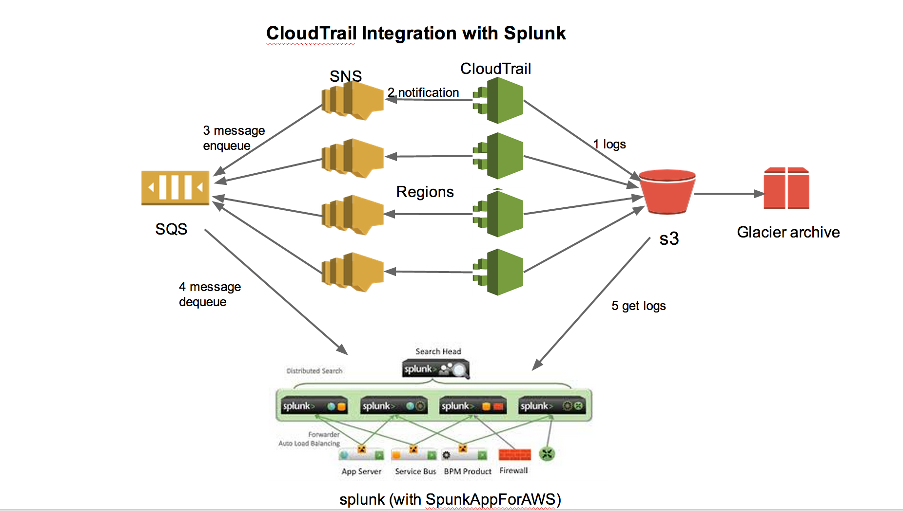

# How to Setup AWS CouldTrail with Splunk

This document describes how to setup AWS Cloudtail services to audit API calls and how to setup SpunkAppForAWS app to generate reports in Splunk.

## What is CloudTrail
[AWS CloudTrail] (http://aws.amazon.com/cloudtrail/) is an AWS service. When enabled, it captures AWS API calls made by or on behalf of an AWS account and delivers log files to an Amazon S3 bucket. 

## Why use CloudTrail
Traditionally system administrators monitor a system's integrity using intrusion detection tools such as Tripwire. System logs are usually sent to 
a central log server for auditing and security analysis.

For services running on AWS, another important operation and security related auditing is to monitor API calls that can change services and environments. 
The AWS CloudTrail is a service that records API call information that includes the identity of the API caller, the time of the API call, the source IP address of the API caller, the request parameters, and the response elements returned by the AWS service. The AWS API call history produced by CloudTrail enables security analysis, resource change tracking, and compliance auditing. ClouldTail service delivers API reports to a S3 bucket within 15 
minutes of an API call. 

## Visualized reporting tools
Many tools are available to generate visualized reports using the CloudTrail files stored in S3 bucket. Here are listed 
[AWS partners](http://aws.amazon.com/cloudtrail/partners/). This documentation describes how to use [SplunkAppforAWS](http://apps.splunk.com/app/1274/) to consume Cloudtrail data and generate reports. 

## The CloudTrail and Spunk integration

In this integration, we create CloudService for each region and Simple Notification Service (SNS) topic for each CloudService. The reports from all regions are aggregated to one S3 bucket. One Simple Queue Service (SQS) is subscribed to all the SNS topics. 

## Prerequisites

* Install AWSCLI
[AWSCLI] (https://github.com/aws/aws-cli) command line tool is used create Cloudtrail. To install(or upgrade) the package

        pip install awscli [--upgrade]

This will install _aws_ command under /usr/local/bin. There 3 ways to setup AWS CLI AWS credentials. The examples here assumes you run the Cloudtrail creation code on an on-premise system and use a configuration file for key id and key secret. If you run it on EC2, you need to create an IAM role and
the aws cli can use role-based token automatically.

* Create a S3 bucket for CloudTrail report
We will aggregate CloudTrail reports from different regions into one S3 bucket. A bucket name used in this example is:
_accountname.myfqdn_. 

Follow the instructions here (http://docs.aws.amazon.com/awscloudtrail/latest/userguide/create_trail_using_the_console.html), but skip the optional steps. We will setup SNS using a script. 

## Create AWS CloudTrail

It is a good idea to monitor all regions even you don't create services on all of the available regions to your AWS account.

* us-east-1
* us-west-1
* us-west-2
* eu-west-1
* sa-east-1
* ap-northeast-1
* ap-southeast-1	
* ap-southeast-2

To enable CloudTrail on these regions, run this code 

The script calls AWSCLI cloudtrail command to:

* Enable Cloudtrail service
* Create Simple Notification Service (SNS) topic for the Cloudtrail service in each region
* Aggregate all regions audit reports in one S3 bucket in us-west-2

We consolidate all CloudTrails reports into one S3 bucket called its-aws-idg-cloudtrail.stanford.edu. The script takes care of creates necessary access policies. Global events - generated by services that don't have a region, e.g. Identity and Access Management (IAM) - will be logged in us-west-2 region only.

## Create a Simple Queue Service (SQS) 

We will setup one message queue named __its-idg-cloudtrail__ in the primary on us-west-2 region. It subscribes to multiple SNS cloudtrail topics created by create-cloudetrail script.  With one message queue, you only need to setup one data input for Splunk to monitor. 

SQS is needed in Splunk AWS app configuration. Splunk AWS app runs at 1 minute interval to retrieve messages from AWS SQS service. The message body contains the S3 bucket location for the Cloudtrail report. Splunk then calls S3 API to get Cloudtrail reports from the S3 bucket.

## Create IAM user

Most documentations you find require you to create an IAM with "Power Admin" access AWS resources. I create an IAM user and try out different policies to get the minimum access privileges needed.

The IAM user __cloudtrail-splunkapp__  haas the necessary ACLs to read SQS, delete message from SQS, and get data from S3 bucket. The following polices work:

* readonly access to S3 bucket
* readonly access to CloudTrail
* full access to the SQS (it deletes messages after read stuff from the message queue)

## Setup Splunk

### Billing and usage module

This requires to setup billing to send CSV files to a S3 bucket, which doesn't work for our consolidated account - need to ask the payer.

### CloudTrail module

The SplunkAppForAWS needs to be installed on the search head (logsh) and indexers (logindex1 and logindex2). The data input only need to be configured on logindex1 and logindex2 where the app will retrieve audit reports and build the indexes. Splunk search head will do search against the logindex servers. 

Setup data input either on Splunk Settings->Data Input console. If you do it on Splunk console, following the following steps:

* Go to "Settings->Data Inputs" 
* Create a new data input
* Fill out the IAM user's key, secret, SQS name, and the region
* In the "Script iterations" box, type "relaunch", otherwise, the app script will stop running after 2048 runs.
* Click "More Advanced Setting", check Source Type to Manual, and "Source" to aws-cloudtrail

It will generate a __inputs.conf__ file, that can be managed by Puppet.

    logindex-dev:/opt/splunk/etc/apps/launcher/local# more inputs.conf 
    exclude_describe_events = 0
	index = aws-cloudtrail
	interval = 1
	remove_files_when_done = 0
	key_id = key
	secret_key = secret
	sqs_queue = its-aws-idg-cloudtrail
	sqs_queue_region = us-west-2
	sourcetype = aws-cloudtrail
	script_iterations = relaunch

 